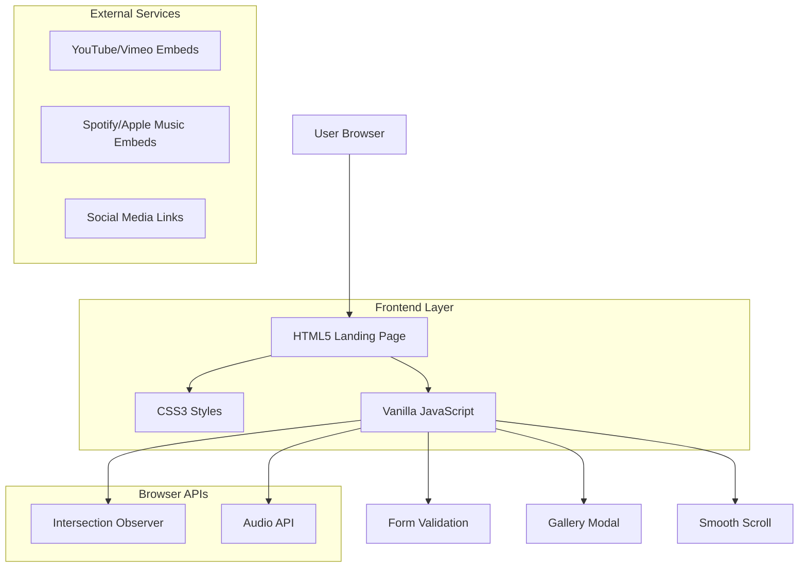

## 1. Arquitetura do Sistema



## 2. Stack Tecnológica

- **Frontend:** HTML5 + CSS3 + JavaScript ES6+
- **Build Tool:** Vite (para desenvolvimento e build otimizado)
- **CSS Framework:** Tailwind CSS (opcional, para agilizar desenvolvimento)
- **Pré-processador:** PostCSS com autoprefixer
- **Otimização:** ImagemMin para compressão de imagens
- **Deploy:** Servidor estático (Netlify, Vercel, ou similar)

## 3. Definições de Rotas

Como é uma single-page application, as rotas são âncoras internas:

| Rota | Seção | Propósito |
|------|-------|-----------|
| #home | Hero Section | Página inicial com animação typewriter |
| #sobre | About Section | Biografia e timeline do artista |
| #musica | Music Section | Player e discografia |
| #videos | Videos Section | Grid de vídeos incorporados |
| #agenda | Schedule Section | Próximos shows e eventos |
| #galeria | Gallery Section | Galeria de fotos com modal |
| #contato | Contact Section | Formulário de contato |

## 4. Estrutura de Arquivos

```
src/
├── index.html
├── assets/
│   ├── css/
│   │   ├── main.css
│   │   ├── components/
│   │   │   ├── header.css
│   │   │   ├── hero.css
│   │   │   ├── player.css
│   │   │   ├── cards.css
│   │   │   ├── gallery.css
│   │   │   └── modal.css
│   │   └── utils/
│   │       ├── animations.css
│   │       ├── responsive.css
│   │       └── variables.css
│   ├── js/
│   │   ├── main.js
│   │   ├── components/
│   │   │   ├── typewriter.js
│   │   │   ├── player.js
│   │   │   ├── parallax.js
│   │   │   ├── scroll-animations.js
│   │   │   ├── card-3d.js
│   │   │   ├── gallery-modal.js
│   │   │   ├── form-validation.js
│   │   │   └── smooth-scroll.js
│   │   └── utils/
│   │       ├── debounce.js
│   │       ├── throttle.js
│   │       └── lazy-load.js
│   ├── images/
│   │   ├── hero/
│   │   ├── albums/
│   │   ├── gallery/
│   │   └── icons/
│   └── audio/
│       └── tracks/
├── dist/ (build output)
└── vite.config.js
```

## 5. Componentes JavaScript Principais

### 5.1 Typewriter Animation
```javascript
class Typewriter {
  constructor(element, text, speed = 100) {
    this.element = element;
    this.text = text;
    this.speed = speed;
    this.index = 0;
  }
  
  type() {
    if (this.index < this.text.length) {
      this.element.innerHTML += this.text.charAt(this.index);
      this.index++;
      setTimeout(() => this.type(), this.speed);
    }
  }
}
```

### 5.2 Audio Player
```javascript
class AudioPlayer {
  constructor() {
    this.audio = new Audio();
    this.isPlaying = false;
    this.currentTrack = 0;
    this.tracks = [];
  }
  
  play() { /* implementação */ }
  pause() { /* implementação */ }
  next() { /* implementação */ }
  previous() { /* implementação */ }
  setVolume(level) { /* implementação */ }
}
```

### 5.3 Intersection Observer para Animações
```javascript
const observerOptions = {
  threshold: 0.1,
  rootMargin: '0px 0px -50px 0px'
};

const observer = new IntersectionObserver((entries) => {
  entries.forEach(entry => {
    if (entry.isIntersecting) {
      entry.target.classList.add('animate-in');
    }
  });
}, observerOptions);
```

## 6. Configuração do Vite

```javascript
// vite.config.js
import { defineConfig } from 'vite';
import { resolve } from 'path';

export default defineConfig({
  root: 'src',
  build: {
    outDir: '../dist',
    rollupOptions: {
      input: {
        main: resolve(__dirname, 'src/index.html')
      }
    },
    minify: 'terser',
    terserOptions: {
      compress: {
        drop_console: true
      }
    }
  },
  css: {
    postcss: './postcss.config.js'
  }
});
```

## 7. Otimizações de Performance

### 7.1 Lazy Loading de Imagens
```html

```

### 7.2 Compressão de Assets
- Imagens: WebP com fallback para JPEG/PNG
- Áudio: MP3 128kbps para streaming
- CSS/JS: Minificação automática via Vite

### 7.3 Cache Strategy
```javascript
// Service Worker básico para cache de assets estáticos
self.addEventListener('fetch', (event) => {
  event.respondWith(
    caches.match(event.request).then((response) => {
      return response || fetch(event.request);
    })
  );
});
```

## 8. SEO e Meta Tags

```html
<!-- Meta tags essenciais -->
<meta name="description" content="Site oficial do artista [Nome] - Música, vídeos, agenda e mais.">
<meta property="og:title" content="[Nome do Artista] - Site Oficial">
<meta property="og:description" content="Descubra a música e os próximos shows de [Nome].">
<meta property="og:image" content="/assets/images/og-image.jpg">
<meta property="og:type" content="website">

<!-- Schema Markup para Músico -->
<script type="application/ld+json">
{
  "@context": "https://schema.org",
  "@type": "MusicGroup",
  "name": "[Nome do Artista]",
  "url": "https://seudominio.com",
  "sameAs": [
    "https://instagram.com/artista",
    "https://spotify.com/artista"
  ]
}
</script>
```

## 9. Testes e Debugging

### 9.1 Browser Compatibility
- Testes manuais nos navegadores principais
- Polyfill para Intersection Observer (IE11)
- Fallback para CSS Grid (Flexbox)

### 9.2 Performance Monitoring
```javascript
// Performance Observer
const perfObserver = new PerformanceObserver((list) => {
  for (const entry of list.getEntries()) {
    console.log(`${entry.name}: ${entry.duration}ms`);
  }
});
perfObserver.observe({ entryTypes: ['measure', 'navigation'] });
```

## 10. Deploy e Entrega

### 10.1 Build de Produção
```bash
npm run build
```

### 10.2 Arquivos de Entrega
- `dist/index.html` (HTML minificado)
- `dist/assets/` (CSS/JS otimizados)
- `dist/images/` (Imagens comprimidas)
- `dist/audio/` (Áudio otimizado)

### 10.3 Documentação de Substituição de Conteúdo
- Imagens: Substituir arquivos na pasta `src/assets/images/`
- Áudio: Adicionar tracks em `src/assets/audio/tracks/`
- Textos: Editar diretamente no HTML
- Cores: Modificar variáveis CSS em `src/assets/css/utils/variables.css`