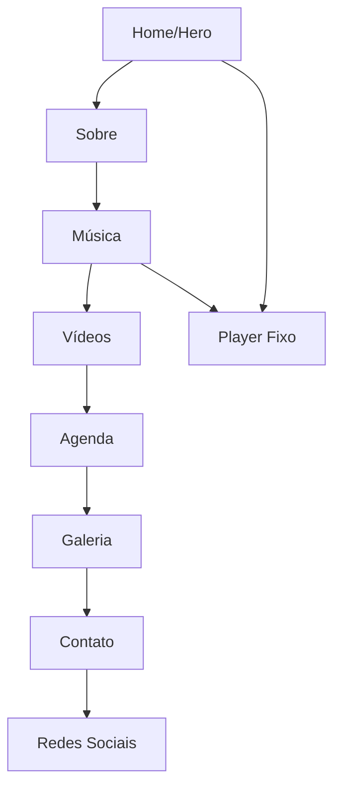

## 1. Visão Geral do Produto

Site moderno e visualmente impactante para artista musical com design responsivo e experiência imersiva. O site apresenta a identidade do artista através de animações suaves, player de música integrado e galeria visual interativa.

**Público-alvo:** Fãs do artista, fãs de música em geral, profissionais da indústria musical.
**Valor de mercado:** Plataforma digital profissional para promoção de música, shows e engajamento com fãs.

## 2. Funcionalidades Principais

### 2.1 Páginas e Seções

O site consiste em uma landing page única com as seguintes seções:

1. **Home:** Hero section com animação typewriter, navegação smooth scroll
2. **Sobre:** Biografia do artista com timeline interativa de carreira
3. **Música:** Player integrado, cards de álbuns/EPs com hover 3D, embeds de streaming
4. **Vídeos:** Grid responsivo de vídeos com integração YouTube/Vimeo
5. **Agenda:** Cards modernos de shows/eventos com data e local
6. **Galeria:** Modal fullscreen com transições suaves entre imagens
7. **Contato:** Formulário funcional com validação e feedback visual

### 2.2 Módulos de Página

| Nome da Página | Módulo | Descrição das Funcionalidades |
|----------------|---------|-------------------------------|
| Header Fixo | Navegação | Menu com smooth scroll para seções, destaque da seção ativa |
| Hero Section | Animação Typewriter | Texto digitado automaticamente apresentando nome e estilo musical |
| Player de Música | Player Fixo | Controles de play/pause, progresso, volume, reprodução contínua |
| Seções Principais | Parallax Scroll | Efeito de profundidade ao rolar a página |
| Elementos de Conteúdo | Fade-in/Slide-up | Animações ao entrar na viewport usando Intersection Observer |
| Cards de Álbuns | Hover 3D | Rotação suave ao passar mouse com efeito de profundidade |
| Galeria de Fotos | Modal Fullscreen | Navegação entre imagens com transições fluidas |
| Botões e Links | Microinterações | Efeitos hover com mudança de cor, scale e ondas |
| Formulário de Contato | Validação Client-side | Validação em tempo real com feedback visual de sucesso/erro |
| Redes Sociais | Links Animados | Ícones modernos com animações hover e links diretos |

## 3. Fluxo de Navegação

**Fluxo Principal do Usuário:**
1. Usuário acessa o site e vê hero section com animação typewriter
2. Navega pelas seções através do menu fixo com smooth scroll
3. Explora conteúdo musical através do player fixo e cards interativos
4. Visualiza vídeos, agenda e galeria com animações fluidas
5. Entra em contato através do formulário validado

## 4. Design de Interface

### 4.1 Estilo de Design

**Cores Principais:**
- Primária: #000000 (Preto) / #1A1A1A (Charcoal)
- Secundária: #6B46C1 (Roxo vibrante) / #FFD700 (Dourado)
- Apoio: #FFFFFF (Branco para textos) / #666666 (Cinza para textos secundários)

**Elementos Visuais:**
- Botões: Estilo moderno com bordas arredondadas, efeitos de hover com scale e brilho
- Tipografia: Sans-serif para headers (Montserrat/Inter), serif/semibold para textos corporais
- Layout: Baseado em grid e flexbox com espaçamento generoso
- Ícones: Estilo line-art moderno com animações suaves

### 4.2 Responsividade

**Abordagem Desktop-First:**
- Desktop: Layout completo com todas as animações e efeitos visuais
- Tablet: Adaptação de grid e fontes, manutenção de funcionalidades principais
- Mobile: Menu hambúrguer, simplificação de animações, otimização de toque

### 4.3 Elementos de Página

| Seção | Módulo | Elementos de UI |
|-------|---------|-----------------|
| Hero | Animação Typewriter | Fonte grande (48-64px), efeito cursor piscante, fundo com overlay escuro |
| Header | Navegação | Logo minimalista, menu horizontal desktop/vertical mobile, indicador ativo |
| Player | Controles | Barra de progresso, botões play/pause/skip, controle de volume, mini capa |
| Cards Álbuns | Hover 3D | Imagem de capa, título, ano, efeito rotateY(15deg) no hover |
| Galeria | Modal | Setas navegação, contador imagens, fechar com ESC/clique fora |
| Formulário | Inputs | Campos com bordas animadas, mensagens de erro em tempo real, botão submit com loading |

## 5. Requisitos Técnicos

### 5.1 Performance
- Lazy loading de imagens com atributo loading="lazy"
- Compressão de imagens (WebP quando possível)
- Minificação de CSS e JavaScript para produção
- Cache browser para assets estáticos

### 5.2 SEO e Acessibilidade
- Meta tags Open Graph para redes sociais
- Schema markup JSON-LD para músico
- Alt text em todas as imagens
- Contraste de cores WCAG 2.1 AA
- Navegação por teclado

### 5.3 Compatibilidade
- Chrome 90+, Firefox 88+, Safari 14+, Edge 90+
- Fallbacks para Intersection Observer
- Polyfills mínimos quando necessário
- Testes em dispositivos iOS e Android